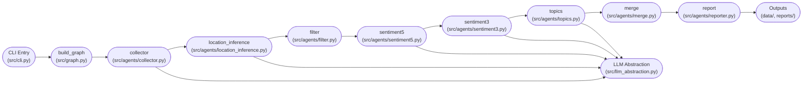

# ASTRA-Pipeline Architecture

```mermaid
flowchart LR
    CLI(["CLI Entry\n(src/cli.py)"])
    G(["build_graph\n(src/graph.py)"])
    C(["collector\n(src/agents/collector.py)"])
    LI(["location_inference\n(src/agents/location_inference.py)"])
    F(["filter\n(src/agents/filter.py)"])
    S5(["sentiment5\n(src/agents/sentiment5.py)"])
    S3(["sentiment3\n(src/agents/sentiment3.py)"])
    T(["topics\n(src/agents/topics.py)"])
    M(["merge\n(src/agents/merge.py)"])
    R(["report\n(src/agents/reporter.py)"])
    LLM(["LLM Abstraction\n(src/llm_abstraction.py)"])
    OUT(["Outputs\n(data/, reports/)"])

    CLI --> G --> C --> LI --> F --> S5 --> S3 --> T --> M --> R --> OUT

    C --> LLM
    LI --> LLM
    S5 --> LLM
    S3 --> LLM
    T --> LLM
```

This diagram illustrates the flow from CLI entry, through graph construction, each agent stage, LLM abstraction interactions, and final outputs.
